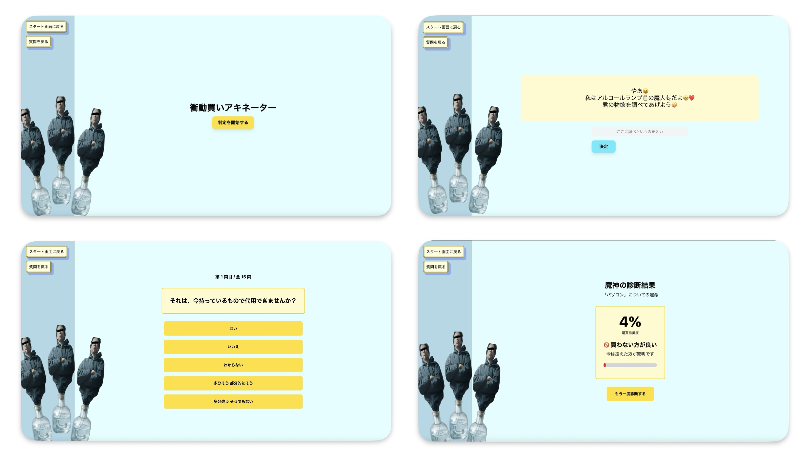
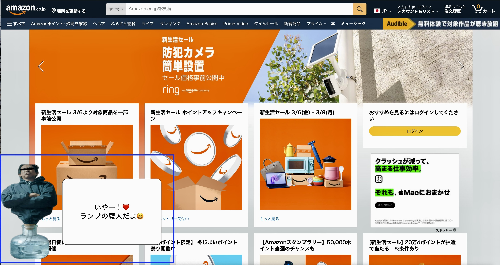
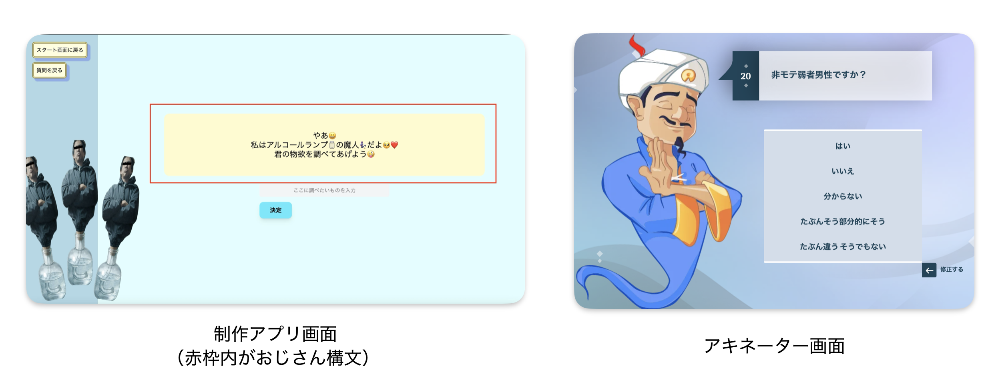

# 衝動買いアキネーター

<!-- プロダクト名に変更してください -->

<!--  -->

<!-- プロダクト名・イメージ画像を差し変えてください -->

## チーム名

チーム12 丸くなれ

<!-- チームIDとチーム名を入力してください -->

## 背景・課題・解決されること

### 通販でついつい買いすぎてしまう人、その買い物、本当に必要ですか？

今回のテーマ **「『本当に欲しい』をカタチに」** より、日常において

#### 本当に欲しいものを買っているのか、無駄な買い物をしていないか

を判断する必要があると考えました。

#### しかし、なかなか買おうと思った時に頭だけで考えるのは難しい...

### <u>じゃあ、アプリで可視化させて、簡単にできるようにしたらいいのでは？</u>

<!-- テーマ「関西をいい感じに」に対して、考案するプロダクトがどういった(Why)背景から思いついたのか、どのよう(What)な課題があり、どのよう(How)に解決するのかを入力してください -->

## プロダクト説明

アプリを開き、購入に悩んでいるものを入力すると、アルコールランプの魔人が本当に欲しいのか考えるための質問を提示します。

<!-- 開発したプロダクトの説明を入力してください -->

## 操作説明・デモ動画

画面上で「判定を開始する」を押していただき、画面の質問に沿って今の自分の気持ちに一番合うものを選択してください。  
15問選択していただくと、判定結果が表示されます。  
サイドバーのボタンを押すことで、スタート画面に戻ったり、1つ前の質問に戻ることができます。

[デモ動画はこちら](https://youtu.be/y6XJjl0Lu8U)

<!-- 開発したプロダクトの操作説明について入力してください。また、操作説明デモ動画があれば、埋め込みやリンクを記載してください -->

## 注力したポイント

<!-- 開発したプロダクトの中で、特に注力して作成した箇所・ポイントについて入力してください -->

### アイデア面

このアプリを一番使う場面として、ネット通販ではないかと考え、Chrome拡張機能として使用できるようになっています。

画面左下（青枠の部分）を押すと、先ほどのアプリ画面に遷移します。

### デザイン面

- 本家アキネーターの構成カラーに近い色にしつつ、UIとしてボタンの位置やボタン内の文字がわかりやすいカラーを使用
- 使っていて少しでも面白いと感じるように、一部メッセージに「おじさん構文」を使用

### その他

## 使用技術

<!-- 使用技術を入力してください -->

<!--
markdownの記法はこちらを参照してください！
https://docs.github.com/ja/get-started/writing-on-github/getting-started-with-writing-and-formatting-on-github/basic-writing-and-formatting-syntax
-->
